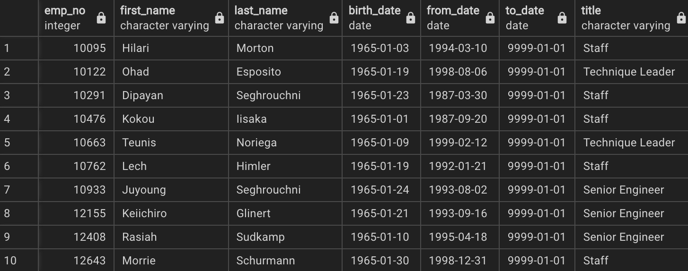
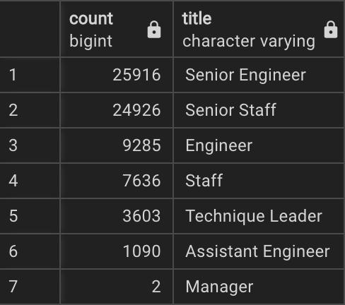

# Pewlett-Hackard-Analysis

## Preparing for the “Silver Tsunami” of Retirement (Overview)

* Being asked by the company Pewlett-Hackard to look into the number of possible retirees, we analyzed the company database in order to determine and filter the data by retirees, retirees by department, and title. Once complete we then look towards the future by coming up with the number of employees eligible for a mentorship program.

### Results:

* Looking at our analysis it was found that over 41,300 employees will be retiring over the course of the next couple of years. 
The departments that are going to be hit the hardest with retirees will be the Engineering team with a total of 25,916 Senior Engineers retiring.

* In order to prepare for the wave of retirement coming we looked at all the employees in mentorship ready positions at the company. With a small snippet of the data above we found that over 1,500 employees are eligible. 

### Summary

* Looking at the figure above we show that in the departments (with the exception of Managers) we have plenty of people to help the company transition from one generation to another.
